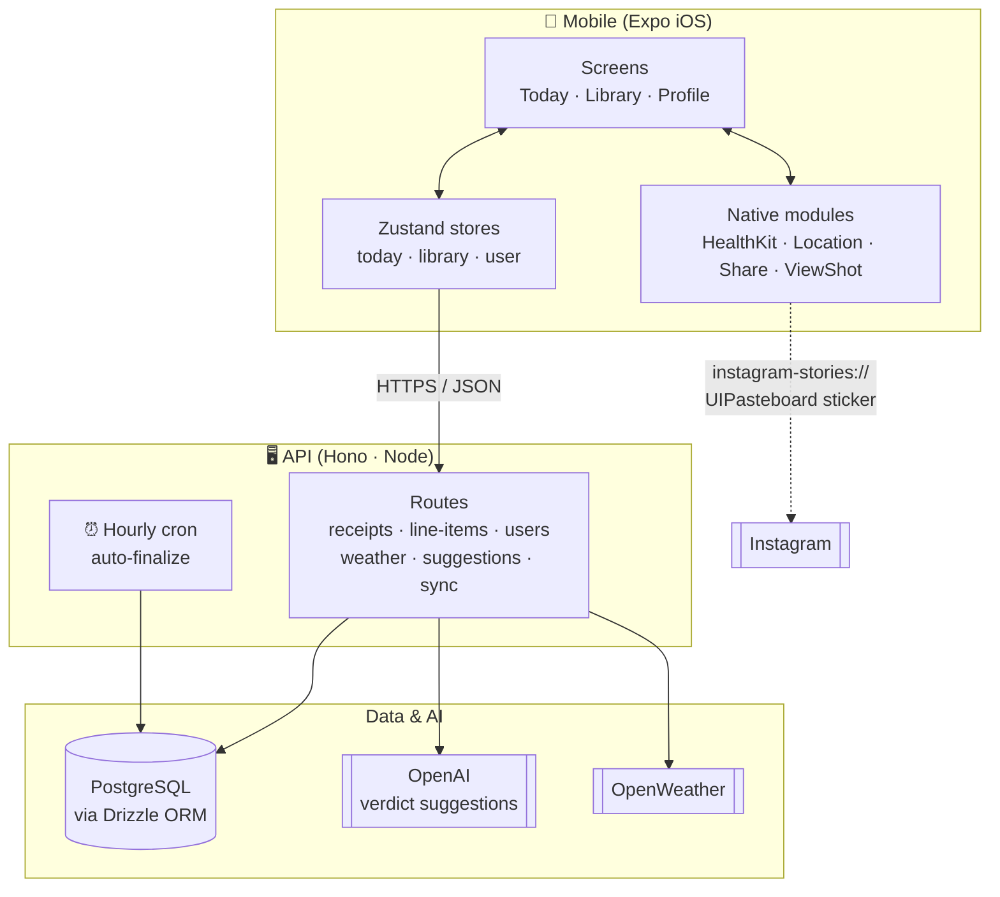

# Spara

A daily life-logging iOS app that generates a thermal-printer-style receipt for your day. Log what you did, finalize at the end of the day to receive an AI-generated verdict, and share to Instagram Stories.

---

## Features

- **Daily receipt** — a running list of your day's line items, styled as a thermal receipt
- **Smart finalization** — an LLM reads your day and suggests a verdict (e.g. *A GOOD ONE*, *BARELY*, *A WEDNESDAY*)
- **HealthKit integration** — sleep hours, awake time, and sleep debt appear on every finalized receipt
- **Weather snapshot** — morning weather and city captured automatically on first open
- **Library** — archive of all past receipts, browsable by year → month with an editorial card grid
- **Instagram Stories share** — capture the receipt as a sticker and share directly to Stories via the native iOS pasteboard bridge
- **4am auto-finalize** — any open receipt past its 4am rollover is automatically finalized with verdict *FORGOTTEN*
- **Profile** — stats (streak, receipt count, good ones), timezone picker, dev tools

---

## Architecture



The mobile app talks to the API over HTTPS. The API persists state in PostgreSQL via Drizzle and calls out to OpenAI for verdict suggestions and OpenWeather for the morning weather snapshot. Sharing to Instagram Stories bypasses the server entirely — the receipt is captured on-device via `react-native-view-shot`, written to `UIPasteboard` as a sticker, and opened in IG via the `instagram-stories://share` URL scheme. A cron job inside the API server scans hourly for receipts past their 4am rollover and auto-finalizes them.

---

## Monorepo structure

```
spara/
├── apps/
│   ├── mobile/          # React Native (Expo SDK 55) iOS app
│   └── api/             # Hono API server (Node.js)
└── packages/
    ├── db/              # Drizzle ORM schema + PostgreSQL migrations
    ├── types/           # Shared TypeScript interfaces
    ├── formatter/       # Formats transcripts + health events into line items
    └── verdicts/        # Curated verdict string list
```

---

## Tech stack

| Layer | Technology |
|---|---|
| Mobile | React Native, Expo SDK 55, Expo Router |
| State | Zustand |
| API | Hono, Node.js, TypeScript |
| Database | PostgreSQL, Drizzle ORM |
| AI | OpenAI (GPT-4o, verdict suggestions) |
| Health | HealthKit via `@kingstinct/react-native-healthkit` |
| Location | `expo-location` |
| Sharing | `react-native-share`, `react-native-view-shot` |
| Monorepo | Turborepo, pnpm workspaces |

---

## Getting started

### Prerequisites

- Node.js 20+
- pnpm 10+
- PostgreSQL database
- OpenAI API key
- Xcode 16+ (for iOS builds)
- CocoaPods (`brew install cocoapods`)

### Install dependencies

```bash
pnpm install
```

### Environment variables

**`apps/api/.env`**
```env
DATABASE_URL=postgresql://...
DEV_USER_ID=<uuid of your user row>
OPENAI_API_KEY=sk-...
OPENWEATHER_API_KEY=...
PORT=3000
```

**`apps/mobile/.env`**
```env
EXPO_PUBLIC_API_URL=http://localhost:3000
EXPO_PUBLIC_DEV_USER_ID=<same uuid>
```

### Database setup

```bash
# Push schema to your database (no migration files needed)
pnpm db:push
```

### Development

Run the API server and start Metro bundler:

```bash
# In one terminal — API server (watches for changes)
cd apps/api && pnpm dev

# In another terminal — Expo Metro bundler
cd apps/mobile && npx expo start
```

### iOS build (required for HealthKit, location, and sharing)

Native modules require a full Xcode build. Run once after initial setup, and again after any `app.json` plugin changes:

```bash
cd apps/mobile
npx expo prebuild --platform ios
npx expo run:ios
```

To run on a physical device:

```bash
npx expo run:ios --device
```

---

## API routes

| Method | Path | Description |
|---|---|---|
| `GET` | `/receipts` | All finalized receipts |
| `GET` | `/receipts/today` | Today's receipt (creates if missing) |
| `GET` | `/receipts/:id` | Single receipt |
| `POST` | `/receipts/:id/finalize` | Finalize with verdict + health snapshot |
| `POST` | `/receipts/:id/snapshot` | Persist weather + location snapshot |
| `POST` | `/receipts/:id/reopen` | Reset to open (dev) |
| `POST` | `/receipts/jobs/auto-finalize` | Trigger auto-finalize scan (dev) |
| `POST` | `/receipts/:id/verdict-suggestions` | LLM verdict suggestions |
| `POST` | `/line-items` | Add a line item |
| `DELETE` | `/line-items/:id` | Remove a line item |
| `GET` | `/users/me` | Current user profile |
| `PATCH` | `/users/me` | Update timezone |
| `GET` | `/weather` | Weather for lat/lng |
| `POST` | `/sync/health` | Sync HealthKit events |

---

## Roadmap

- **Lock Screen / Control Center widget** — single-tap iOS 18 widget that deep-links into the add-a-line modal
- **Auth** — Apple Sign-In + JWT sessions to replace the dev user hardcode
- **Notifications** — morning log reminder and evening finalize nudge, driven by existing `notification_prefs` user column
- **`verdictTone` field** — store `good | meh | barely` at finalize time so library stats and month sparklines are accurate
- **Visit Monitoring** — detect when the user spends time at a location (cafe, gym, work) via iOS `CLLocationManager` visits API, look up nearby POI via Foursquare, and prompt to add to the receipt

---

## Scheduled jobs

The API runs a cron job via `croner` that fires every hour at `:00`. It finalizes any open receipt where the user's local time has crossed the 4am rollover into the next day — assigning verdict `FORGOTTEN` and `finalizeMode: auto_4am`.

On server startup, the same scan runs immediately to catch any receipts missed during downtime.
